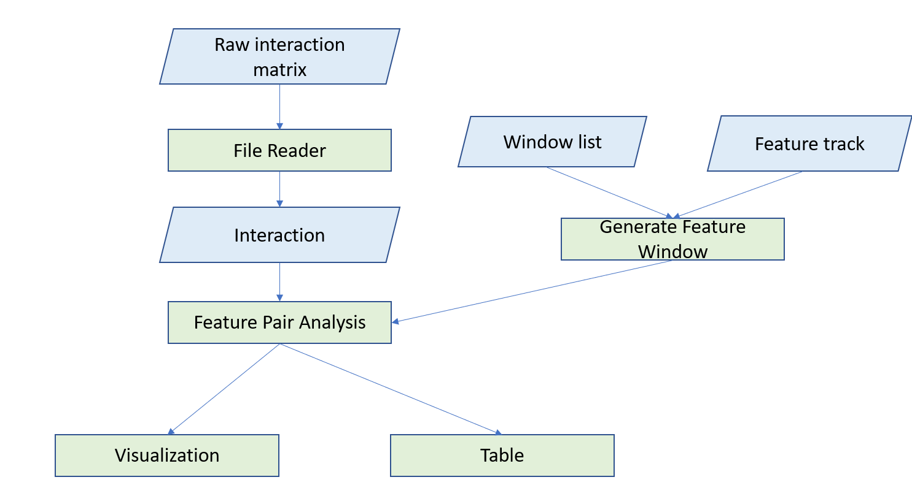

# Feature_Pair_Analysis

## Introduction

Genome architecture mapping (GAM) is a new 3D genome profiling technique that doesn't depend on DNA ligation [cite GAM]. To find the epigenomic feature pairs in the contacts, we develop this pipeline. It can be used in both Hi-C and GAM contacts

## High-level Workflow

## Requirement

1. numpy
2. matplotlib
3. pandas
4. plotly
